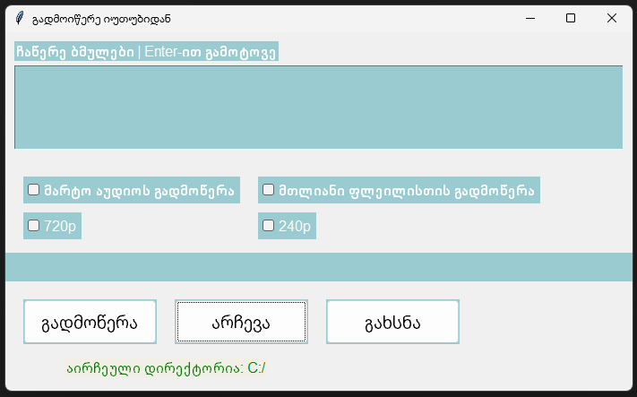

# Requirements
საჭიროა ffmpeg ის დაინსტალირება სისტემაზე

# Download options

* მხოლოდ აუდიოს გადმოწერა
* მთლიანი ფლეილისთის გადმოწერა
* ვიდეოების მაქსიმუმ 1080p ში გადმოწერა

თუ მომხმარებელი არ მონიშნავს კონკრეტული ვიდეოს ხარისხს მაშინ გადმოიწერება 1080p ხარისხში
1080p ხარისხის მხარდაჭერა თუ არ აქვს ვიდეოს მაშინ გადმოიწერს შესაძლებელ ყველაზე მაღალ ხარისხს

იდენტურად თუ ვთქვათ 720p იქნება არჩეული და ვიდეოს არ ექნა ეს გაფართოება გადმოიწერს შესაძლო უმაღლეს ხარისხში!.

[პროგრამის გადმოწერა](https://github.com/beberi1/YouTube_video_downloader/releases/download/v1.5/YouTube_video_downloader.exe)

[CLI ვერსიის გადმოწერა](https://github.com/beberi1/YouTube_video_downloader/releases/download/v1.6/YTvideo_downloader_cli.exe)

!ვინდოუსი აღიქვსმს ვირუსად და სჭირდება სერტიფიცირება 

